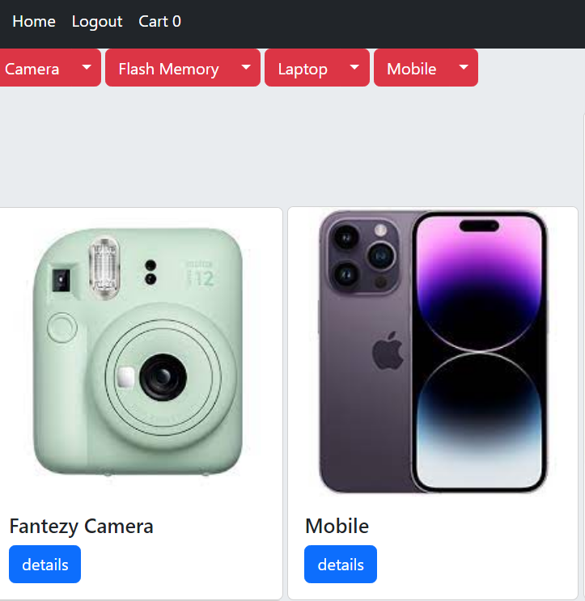
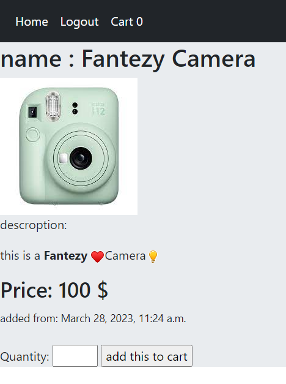
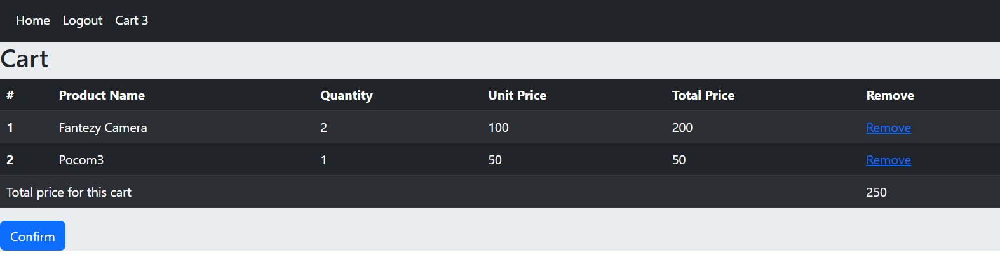

# Web Store by Django

This repo contains source codes for **web store** written by **django** framework based on [mongard](https://www.mongard.ir).
I also learned: **Cloud storage** by AbreArvan, **peyment** by Zarinpal, **cache** by redis and connecting to **Postgresql** but not implemented in this repo.




**home page of web store contains products and navbar.**




**detail page of one sample product, you can add it to cart.**


## Main Options
registering users based on phone and verification sms code,(overwiting User Model)
login and logout and see all categories, products, price and descriptions. By clicking on details you can see more details of each product.
you can add  product and category and sub category. Also in detail page of each product you can order and then see your final cart (contains products,prices and remove button) 
in home page sub categories can seen in dropdown buttons.




**cart contains products, quantity and price.**

## some implemamtation details

in this project we completly have custtemized User admin pannels, for example verification for user is based on  phone number instead of username, and number will be verificated by code that messaged to phone.
if your products are a few, you can load image directly to app.
for loading image in development phase, we add this to urlpattetns in main app:
```
static(settings.MEDIA_URL, document_root=settings.MEDIA_ROOT)
```
dont forget removing it in production phase.

by customizing admin-django command, in account app, we added `remove_expired_otp` for removing expired verification code. pytz pakage is uused for handling timezone (also in setting `TIME_ZONE='Asia/Tehran'`) 

in navbar you can see total number of selected products near cart button. it was implemented by context proccesor and | length filter. (defining __len__ is used for Cart class)

Main focus of this project is on backend featur (not fronend) but we used **Bootstrap** to have more conveninent output. Also thired-party app called **ckeditor** used for styling textfields. 

_________________________________________________________________________
## Requrements
it is recomended to use venv and then pip install -r requirements.txt
```
amqp==5.1.1
asgiref==3.6.0
billiard==3.6.4.0
celery==5.2.7
click==8.1.3
click-didyoumean==0.3.0
click-plugins==1.1.1
click-repl==0.2.0
colorama==0.4.6
cron-descriptor==1.2.35
Django==4.1.7
django-celery-beat==2.5.0
django-ckeditor==6.5.1
django-js-asset==2.0.0
django-timezone-field==5.0
kombu==5.2.4
Pillow==9.4.0
prompt-toolkit==3.0.38
python-crontab==2.7.1
python-dateutil==2.8.2
pytz==2023.2
six==1.16.0
sqlparse==0.4.3
tzdata==2022.7
vine==5.0.0
wcwidth==0.2.6

```
